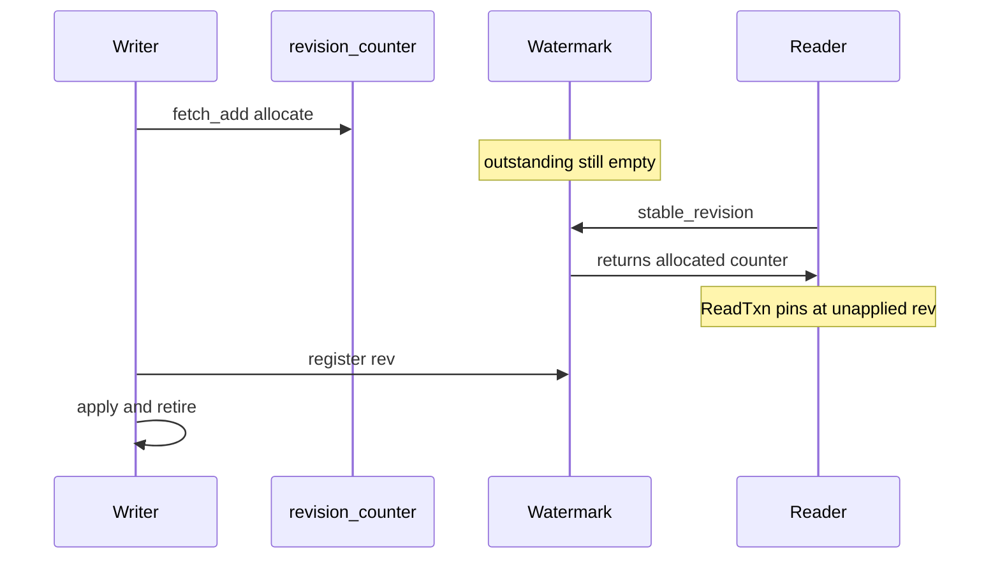
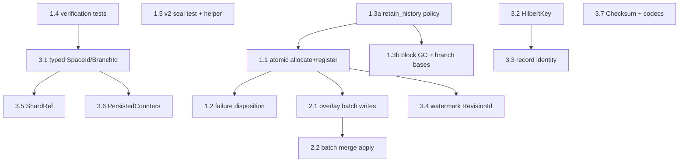

# InfiniteDB v0.3.x — Follow-Up Plan: Residual Holes & Type Hygiene

> Companion to `CRCW_FIX_PLAN.md` (now largely implemented). This plan covers
> (A) the residual correctness and performance holes found in the post-
> implementation re-review, and (B) the primitive-obsession hygiene track that
> makes lossy-id-encoding bugs unrepresentable. Same conventions: each task is
> self-contained — files, precise problem, behavioral fix spec, acceptance
> test — and ordered by dependency.

---

## 0. Context for the agent

The first plan landed: latest-wins visibility (`resolve_visibility`), atomic
`ShardView` publish, the `RevisionWatermark`, group commit
(`group_commit.rs`), `insert_many`/`WriteBatch`, chunked live tails,
seal-from-memory, range decomposition, shard-local compaction
(`compactor.rs`), branch `overlay.log` durability, lazy shards, and parallel
sync fan-out. This plan fixes what the re-review found still broken or
unfinished, then hardens the type layer.

**Ground rules (unchanged from plan 1):**
- `cargo test --all-features` green after every task.
- Doc comments on every public item; `io::Result` for fallible storage ops;
  `bincode` Encode/Decode on persisted types.
- Prefer new modules over growing existing files (seal helper, `PersistedCounters`,
  coordinate codecs).
- Mirror fixes across `engine/io_thread.rs` and `engine/space_io.rs`, or
  factor into a shared helper, unless a task says otherwise.
- Note public API changes in `CHANGELOG.md` under `Unreleased`.
- Phase 3 tasks are refactors: they must not change observable behavior, and
  each must compile-break every call site they retire (no parallel old/new
  paths left behind).

### 0.1 — Verified status (post code-review)

| Task | Status | Notes |
|------|--------|-------|
| **1.1** | Done | Watermark owns `allocate`/`allocate_n`; branch lifecycle unified |
| **1.2** | Done | `retire_failed`, `failed_revisions()`, inject test |
| **1.3a** | Done | `CompactionPolicy`, default keep-all, `compact_with` |
| **1.3b** | Done | Block GC + branch-base pinning; `branch_bases.bin` persistence |
| **1.4** | Done | Verification tests; `pack_shard_key` already removed |
| **1.5** | Mostly done | v2 interleaved-space seal test; shared `seal.rs` helper still open |
| **2.1** | Done | Cached overlay writers + `append_batch_with_durability` |
| **2.2** | Done | `apply_records_on_branch`, batch import/converge |
| **3.1–3.5, 3.7** | Done | Typed ids, `HilbertKey`, `ShardRef`, identity keys, watermark `RevisionId`, `Checksum` |
| **3.6** | Done | `PersistedCounters` struct + migration |

### 0.2 — Test inventory (extend, don't reinvent)

| File | Covers |
|------|--------|
| `tests/crcw_correctness.rs` | Visibility, `stable_revision` lag, `large_space_id`, overlay key isolation |
| `tests/concurrent_db_phase_b.rs` | `enqueue_batch` with caller-supplied revisions (v3) |
| `tests/durability.rs` | Restart / durability matrix (v4) |
| `src/infinitedb_storage/compaction.rs` | Unit tests for `retain_history` dedup (not wired to engine) |
| `src/infinitedb_storage/gc.rs` | Unit tests for `apply_retention` (not wired to engine) |

---

## PHASE 1 — RESIDUAL CORRECTNESS

### 1.1 — Atomic revision allocation + registration

**Files:** `src/engine/watermark.rs`, `src/concurrent/concurrent_db.rs`
(`next_revision`, `insert_on_branch`, `delete_on_branch`, `insert_many`,
`enqueue`, `enqueue_batch`)

**Problem.** `next_revision()` advances the allocation counter, and only later
does `enqueue()` call `watermark.register()`. In the window between the two, a
`stable_revision()` call sees an empty outstanding set and returns the
allocation counter — which already includes the unapplied revision. A
`ReadTxn` opened in that window pins at a ceiling covering a write that hasn't
landed, and the record materializes later under the same pin: the exact
non-repeatable read Task 1.3 of plan 1 was built to prevent, surviving in a
few-instruction window. Branch writes are worse: they bump `revision` but
**never** call `watermark.register()` or `retire()` at all, so
`stable_revision()` can include branch allocations when outstanding is empty.
The root cause is that allocation and registration are two separate operations
against state that `stable_revision` reads in between.

**Evidence:** `watermark.rs:43-44` returns `allocated` when outstanding is
empty; `concurrent_db.rs:706-708` allocates via `fetch_add` without register;
`concurrent_db.rs:689-696` branch path skips watermark entirely;
`concurrent_db.rs:698` registers only after allocation on main path.

**Fix.** Make the watermark the sole authority for revision allocation:

1. Move the allocation counter into `RevisionWatermark` behind the same lock
   as the outstanding set. Provide one operation, `allocate()`, that takes the
   lock, increments the counter, inserts the new revision into the outstanding
   set, and returns it — so no revision can ever be visible to
   `stable_revision` as "allocated but not outstanding." Provide a contiguous
   `allocate_n(count)` for `insert_many` (one lock acquisition, one contiguous
   range inserted).
2. `InfiniteDb::next_revision` delegates to `watermark.allocate()`. The
   shared `Arc<AtomicU64>` constructor parameter goes away; `revision()` reads
   the counter through the watermark. Persistence of the counter in
   `counters.bin` and recovery initialization route through a watermark
   constructor that seeds the counter.
3. **All writes** — main and branch — use the same doorway: `allocate()` (or
   `allocate_n`), apply (group commit or overlay batch), then `retire()` (or
   `retire_failed` on error, Task 1.2). Branch overlay apply is synchronous, so
   allocate and retire can bracket the overlay write in one call stack.
4. `enqueue_batch` is **public** and used in `tests/concurrent_db_phase_b.rs`
   with caller-supplied revisions. Re-specify it to require
   watermark-allocated revisions only (internal allocation before job
   construction). Update the test to allocate through the watermark API.
   Document the contract on `enqueue_batch` and note the breaking change in
   `CHANGELOG.md`.

**Acceptance.**
- Loom-style or tight-loop race test: one thread alternating
  allocate-then-apply with a deliberate yield between them, another thread
  polling `stable_revision()`; assert stable never equals or exceeds an
  allocated-but-unretired revision. (Without the fix this fails within
  milliseconds given a yield injected between the old `next_revision` and
  `register`.)
- Branch write test: after `insert_on_branch`, `stable_revision()` does not
  advance past the applied branch revision until retire semantics are satisfied
  (or branch revisions are excluded from stable — document whichever model is
  chosen; prefer unified lifecycle).
- Existing watermark monotonicity and sync-convergence tests still pass.
- `insert_many` of N rows performs exactly one watermark lock acquisition for
  allocation (counter assertion in a test build).

---

### 1.2 — Watermark failure disposition (a failed write must not freeze time)

**Files:** `src/engine/watermark.rs`, `src/engine/group_commit.rs`, shard I/O
loops (`io_thread.rs`, `space_io.rs`), `src/concurrent/concurrent_db.rs`
(`enqueue`, `enqueue_batch`, `sync`)

**Problem.** Revisions are retired only on successful apply. If a group's
fsync fails, its revisions remain outstanding forever; if `enqueue` errors
after registration (broken-pipe path), same. If `enqueue_batch` registers
multiple revisions then fails on coordinator/queue send, there is no rollback.
The stable revision is then pinned below the failed revision permanently: every
subsequent `ReadTxn` silently reads an ever-staler snapshot while later writes
continue to land and be visible to unpinned queries. A single transient I/O
error converts the repeatable-read mechanism into a slow-motion outage with no
signal.

**Evidence:** `group_commit.rs:100-125` retires only after successful
`sync_group`; `io_thread.rs:323-326` sets `pending_error` without watermark
cleanup; `concurrent_db.rs:698-702` registers before queue send;
`write_queue.rs:112-115` returns `BrokenPipe` with no retire.

**Fix.** Give every registered revision a terminal disposition:

1. Add a failure path to the watermark: `retire_failed(rev)` removes the
   revision from the outstanding set (allowing stable to advance past it) and
   latches it in a small failed-revision record (revision + error string +
   timestamp, bounded ring).
2. Group-commit failure: when the batch fsync fails, the loop calls
   `retire_failed` for every revision in the group (none were published —
   correct), stores the error in `pending_error` as today, and additionally
   marks the failed range so the error surfaced by the next `sync()` names
   the revision span that was lost.
3. Enqueue failure: every error return path in `enqueue`/`enqueue_batch`
   after allocation/register calls `retire_failed` for all affected revisions
   before propagating the error.
4. Semantics to document on `stable_revision`: "every revision ≤ stable has
   either been durably applied or has been reported as failed through
   `sync()`/the failed-revision log; stable never waits on a revision that
   can no longer succeed."
5. Expose `InfiniteDb::failed_revisions()` (or fold into `io_stats`) so
   callers can observe losses without parsing error strings.

**Acceptance.**
- Inject an fsync failure (test-only failpoint in `HotSegment::sync_group`)
  mid-stream: assert `stable_revision` continues to advance past the failed
  group, the next `sync()` returns the error naming the failed span, the
  failed records are absent from queries, and subsequent writes succeed and
  become visible.
- Kill the shard channel (simulate I/O thread death) after registration:
  assert the insert error propagates and stable is not pinned by the
  orphaned revision.
- `enqueue_batch` partial-failure test: register N revisions, fail on send,
  assert all N are `retire_failed` and stable is not pinned.

---

### 1.3a — Compaction must not destroy MVCC history by default

**Files:** `src/engine/compactor.rs`, `src/infinitedb_storage/compaction.rs`,
`src/infinitedb_storage/gc.rs`, `OpenOptions`/`SpaceConfig`,
`src/concurrent/concurrent_db.rs` (`compact`)

**Problem.** `maybe_compact_after_seal` hardcodes `retain_history: false`, so
routine ingest (every 8 small blocks per shard) permanently drops all
non-latest revisions. `as_of` time travel — a core pillar — silently stops
working past a moving compaction horizon. `CompactionConfig::default()` sets
`retain_history: true`, but the compactor overrides it.

**Evidence:** `compactor.rs:58-63` hardcodes `retain_history: false`;
`compaction.rs:84-92` deduplicates by coordinate when false;
`crcw_correctness.rs` `latest_wins` test does not trigger auto-compaction
(needs ≥8 seals per shard).

**Fix.**
1. Default the automatic trigger to `retain_history: true`. History-dropping
   compaction becomes opt-in via configuration: add a per-space (preferred,
   on `SpaceConfig`) or per-database (`OpenOptions`) compaction policy with
   three modes — keep-all (default), retention-window (drop revisions older
   than a configured `RevisionId` horizon, wiring through the existing
   `RetentionPolicy` in `gc.rs`; note `version_horizon` is documented but
   not yet implemented in `apply_retention` — implement it here), and
   latest-only (current destructive behavior, explicit).
2. The manual `InfiniteDb::compact(space)` gains a policy parameter (or a
   `compact_with` variant) so tests and operators can choose per invocation;
   the no-argument form uses the configured policy. v2 `compact()` remains
   a no-op; v2 auto-compaction via `io_thread.rs` uses `shard_filter: None`
   across the shared tail — document that limitation.
3. Wire `apply_retention` into the compaction pipeline so tombstone pruning
   honors `tombstone_horizon` — and document the invariant that a trailing
   tombstone may only be pruned when no block *outside* the compaction input
   can contain an older live record at that address; under shard-local
   compaction the safe simple rule is: never prune a tombstone that is the
   latest record at its address unless the retention horizon exceeds it AND
   the compaction input spans the address's full key range in this shard.
   When in doubt, keep the tombstone — it is small and correct.

**Acceptance.**
- Time-travel regression: ingest several revisions of the same addresses,
  force enough small seals to trigger auto-compaction (≥8 blocks per shard),
  then `as_of` query at an early revision returns the historical data (fails
  today).
- Latest-only mode (explicitly configured) reproduces current behavior.
- Retention-window mode: revisions older than the horizon are gone from raw
  block scans; newer history survives; `as_of` above the horizon is exact.

**Depends on:** nothing. **Blocks:** 1.3b (policy must be stable first).

---

### 1.3b — Block-file GC with branch-base safety

**Files:** `src/engine/compactor.rs`, `src/infinitedb_storage/gc.rs`
(`safe_to_delete`, `apply_retention`), `src/engine/branch_overlay.rs`,
`src/concurrent/concurrent_db.rs`

**Problem.** The concurrent compaction path removes superseded entries from the
in-memory snapshot index and live tail but **never** calls `safe_to_delete` or
deletes superseded block files on disk. Superseded blocks accumulate as orphans.
When physical deletion is added, it must respect branch base snapshots and
pinned reader views; the defer-delete guard specified in plan 1 Task 3.4 is
not wired.

**Evidence:** `compactor.rs:88-100` updates index/tail only; `safe_to_delete`
in `gc.rs:60-74` is called only from `legacy_v1/db.rs` and unit tests; no
engine path collects branch-base snapshots for GC.

**Fix.**
1. After compaction publishes the new block set, compute superseded `BlockId`s
   and pass them to `safe_to_delete` with a live-snapshot set that includes:
   the current snapshot head, every branch base snapshot in
   `BranchOverlayStore`, and any pinned reader view (add a defer-delete list
   if reader pins cannot be enumerated at compaction time).
2. Delete only blocks returned by `safe_to_delete`; defer the rest until
   unreferenced.
3. Log or expose deferred-delete count in `io_stats` for operators.

**Acceptance.**
- Branch-base GC test: create a branch, compact main past the base, assert
  the base's referenced block files still exist and `query_on_branch` reads
  through the base correctly.
- After compaction with no active branches, superseded block files are removed
  from disk; reopen + query still succeeds.
- Deferred blocks are deleted once the last branch referencing them is cleared.

**Depends on:** 1.3a (compaction policy), 3.1 (typed ids help branch-base
collection). Can start after 1.3a if branch-base enumeration uses existing APIs.

---

### 1.4 — Key-encoding verification (mostly done)

**Files:** `src/engine/hilbert_live_tails.rs`, `src/engine/hilbert_shard.rs`
(`ShardKey`), `src/engine/branch_overlay.rs` (`OverlayKey`)

**Status:** Plan 1's `pack_shard_key` / 48-bit shift packing is **already
removed** from `src/engine/`. `HilbertLiveTails` keys on composite `ShardKey
{ space_id, shard_id }`; branch overlays use `OverlayKey { branch_id,
space_id }`. Remaining risk is raw `u64` fields on those structs (Task 3.1).

**Problem.** The lossy-encoding bug class is fixed in structure but not fully
verified under stress: multi-shard writes to endpoint `SpaceId` values and
collision isolation lack dedicated coverage.

**Evidence:** `hilbert_shard.rs:38-48` defines `ShardKey`; no `pack_shard_key`
in `src/engine/`; `crcw_correctness.rs:238-250` tests single-space large id;
`crcw_correctness.rs:253-278` tests overlay key isolation.

**Fix.** Verification only — no structural change expected:
1. Grep/CI assert: no `space_id >> 16` or `pack_shard_key` in `src/engine/`.
2. Add test: register and write to `SpaceId(u64::MAX - 1)` under format v4
   with **multiple shards** (force Hilbert routing across shards); queries
   return all records.
3. Add test: second space whose old packed-key encoding would have collided
   remains isolated from the first.
4. Defer `ShardKey.space_id: u64` → `SpaceId` to Task 3.1.

**Acceptance.** Tests above pass; grep assertion clean. No `pack_shard_key`
callers remain anywhere in `src/`.

---

### 1.5 — v2 seal: test coverage + shared helper (filter already implemented)

**Files:** `src/engine/io_thread.rs` (`seal_space`), `src/engine/space_io.rs`
(`seal_space`), new shared seal helper module

**Status:** v2 `seal_space` **already filters** records by target space before
sorting/sealing (`io_thread.rs:375`). Other spaces' records remain in the
shared tail. This task is verification, deduplication, and test coverage — not
adding the filter.

**Evidence:** `io_thread.rs:371-377` filters `r.address.space.0 == space_id`;
`space_io.rs:305-307` needs no filter (per-space I/O thread); no v2-format
tests exist in `tests/`.

**Problem.** v2 and v3/v4 seal bodies are duplicated and can drift. There is
no regression test for interleaved multi-space seals on v2. Separately, v2
`maybe_compact_after_seal(..., shard_filter: None)` compacts across the shared
tail — a follow-up risk distinct from seal partitioning.

**Fix.**
1. Extract seal body into a shared helper (e.g. `engine/seal.rs`) with an
   explicit `space_predicate: impl Fn(&Record) -> bool` parameter. v2 passes
   `|r| r.address.space.0 == space_id`; v3/v4 pass `|_| true`.
2. Add v2-format test: interleave writes to two spaces, force seal of one
   space, assert the other space's records remain queryable, appear in no block
   belonging to the sealed space, and seal of the second space captures exactly
   its own records.
3. Document v2 shared-tail compaction limitation; optional follow-up: pass
   space filter into `maybe_compact_after_seal` on v2.

**Acceptance.** v2 interleaved-two-spaces seal test passes. v2 and v3/v4 seal
logic share one helper; diff is only the predicate. Existing seal-window test
(`crcw_correctness.rs`) still passes.

---

## PHASE 2 — BRANCH WRITE PATH

### 2.1 — Cached overlay writers + batch append for branch writes

**Files:** `src/engine/branch_overlay.rs`, `src/concurrent/concurrent_db.rs`
(`enqueue`, `enqueue_batch`, `insert_many_on_branch`)

**Problem.** `append_with_durability` opens a fresh `WalWriter` — file open,
append, fsync, close — for every single branch record. `enqueue`,
`enqueue_batch`, and `insert_many_on_branch` all funnel through this path.
`WalDurability::Buffered { sync_every: 1 }` forces fsync per frame. Branch
ingest is orders of magnitude slower than the group-committed main path, for no
durability benefit.

**Evidence:** `branch_overlay.rs:89-95` open/append/sync per call;
`concurrent_db.rs:461-467` routes non-main jobs one-at-a-time;
`concurrent_db.rs:689-696` single-record `enqueue` same path.

**Fix.**
1. `BranchOverlayStore` holds an open `WalWriter` per `OverlayKey` (DashMap
   of writers, created on first write, closed on `clear_branch`), eliminating
   per-record open/close.
2. Add `append_batch_with_durability(branch, space, Vec<Record>)`: append all
   frames, **one fsync per (branch, space) batch** (not `sync_every: 1` per
   frame), then publish all records to the overlay tail in one `extend_chunk`
   (`live_tail.rs:50`). `enqueue_batch` partitions non-main jobs by
   `OverlayKey` and calls the batch path per group; single-record paths become
   a batch of one.
3. Watermark interaction (**requires Task 1.1**): `allocate_n`, apply batch,
   `retire` batch — under the same disposition rules as main (Task 1.2:
   failed overlay fsync calls `retire_failed` for the whole batch).

**Acceptance.** Durability test from plan 1 (crash before merge, reopen,
branch records present) still passes. Throughput test: `insert_many_on_branch`
of 10k rows performs O(1) file opens and O(1) fsyncs per (branch, space)
group, not O(rows) (fsync counter assertion). Overlay log replay after
non-clean shutdown reconstructs the batch-written records.

**Depends on:** 1.1 (branch watermark lifecycle), 1.2 (failure disposition).

---

### 2.2 — Batch the merge apply path

**Files:** `src/concurrent/concurrent_db.rs` (`merge_branch`),
`src/infinitedb_sync/replicate.rs` (`import_branch_overlay`,
`converge_main_records`)

**Problem.** Three apply surfaces loop per-record with linear overhead:
`merge_branch` calls `insert_on_branch`/`delete_on_branch` per record (each
allocates via `next_revision` and re-enters `enqueue`); `import_branch_overlay`
does the same for branch targets; `converge_main_records` calls `local.insert`
per record for main targets. Large merges and sync imports pay N× allocation,
routing, and (pre-2.1) fsync cost.

**Evidence:** `concurrent_db.rs:403-415` per-record merge apply;
`replicate.rs:84-98` per-record branch import;
`replicate.rs:125-133` per-record main converge via `insert`.

**Fix.** Re-express each apply loop over the batch surface:
1. **`merge_branch`:** partition applied records into inserts and tombstones;
   `allocate_n` once per partition; build `WriteJob`s with cached Hilbert keys;
   submit via `enqueue_batch` (main) or overlay batch path (branch, Task 2.1).
2. **`import_branch_overlay`:** same batch path for branch targets.
3. **`converge_main_records`:** batch via `insert_many` / `enqueue_batch` for
   main targets (not `insert` per record).
4. **Document on `merge_branch`:** applied records receive **fresh global
   revisions** (the merge is a new commit, not a replay of source revisions).
   This determines `as_of` behavior across merges — state explicitly in doc
   comment and `CHANGELOG.md`.

**Acceptance.** Merge of a 10k-record branch into main completes with fsync
count proportional to shard count, not record count; one `allocate_n` per
partition, not N `next_revision` calls. Merge result records and conflict
semantics byte-identical to the per-record path on the existing merge test
suite; `converge_with_branch_merge` end-to-end test unchanged.

**Depends on:** 1.1 (`allocate_n`), 2.1 (overlay batch path).

---

## PHASE 3 — TYPE HYGIENE (primitive obsession)

> Ordering note: 3.1 and 3.2 are the load-bearing ones — each retires a
> pattern that has already produced a bug. 3.3 carries a performance rider.
> 3.4 is insurance for the HLC migration (blocked on 1.1). 3.5–3.7 are
> cheap and mechanical.

### 3.1 — The engine speaks `SpaceId`/`BranchId`, not `u64`

**Files:** `src/engine/hilbert_coordinator.rs`, `src/engine/coordinator.rs`,
`src/engine/space_io.rs`, `src/engine/io_thread.rs`,
`src/engine/hilbert_live_tails.rs`, `src/engine/space_live_tails.rs`,
`src/engine/write_queue.rs`, `src/engine/branch_overlay.rs` (`OverlayKey`),
`src/engine/hilbert_shard.rs` (`ShardKey`)

**Problem.** Typed ids dissolve at the engine membrane: `flush_space(space.0)`,
`views_for_space(space.0)`, `hot: HashMap<u64, HotSegment>`,
`SpaceIoState.space_id: u64`, `IoCommand::Flush { space_id: u64 }`,
`OverlayKey { branch_id: u64, space_id: u64 }`, `ShardKey.space_id: u64`.
The `pack_shard_key` truncation bug lived in exactly this anonymity — once a
space is bare bits, a lossy shift compiles. (`pack_shard_key` is already
removed; `ShardKey` and `OverlayKey` are composite but still raw `u64`.)
Public `InfiniteDb` APIs already take `SpaceId`/`BranchId`; anonymity is
internal engine routing.

**Evidence:** `write_queue.rs:90` `IoCommand::Flush { space_id: u64 }`;
`io_thread.rs:175` `HashMap<u64, HotSegment>`;
`branch_overlay.rs:22-24` `OverlayKey` raw fields.

**Fix.** Sweep the engine layer: every map key, struct field, function
parameter, and `IoCommand` variant that currently carries a raw `u64` space
or branch id carries `SpaceId`/`BranchId` instead. `.0` unwrapping is
permitted only at genuine serialization boundaries (file/directory names,
on-disk encodings) — and each such site gets a one-line comment naming the
boundary. Combine with Task 1.4 verification and Task 3.5 so composite keys
land as typed structs in one pass.

**Acceptance.** Full suite green (pure refactor); a `rg`-based CI check or
test asserting no `space_id: u64` fields and no `HashMap<u64,` keyed on
space/branch remain under `src/engine/` outside the documented
serialization sites.

---

### 3.2 — Explicit cached/unset Hilbert key (kill the zero sentinel)

**Files:** `src/infinitedb_core/block.rs` (`Record`), `src/engine/query.rs`
(`record_hilbert_key*`), `src/engine/write_queue.rs`,
`src/engine/hilbert_coordinator.rs`, `src/engine/io_thread.rs`,
`src/engine/space_io.rs` (seal sorts), WAL/overlay replay sites

**Problem.** `hilbert_key: u128` where "zero means recompute" encodes a cache
state machine in a magic value enforced by a comment. A record legitimately
at the origin has key zero, so it recomputes on every touch — harmless today
only because the recomputation returns zero again; the trap springs the day
someone optimizes the fallback. Seal paths sort by raw `hilbert_key` without
resolving unset keys. With the HLC redesign, `RevisionId` becomes a packed
`u128`, putting two unrelated bare `u128` currencies in the same engine.

**Evidence:** `block.rs:20-22` zero-sentinel comment;
`query.rs:30-35` `hilbert_key != 0` check;
`space_io.rs:312-320` seal sort uses raw field;
`hilbert_coordinator.rs:142-143` `job.hilbert_key != 0` routing.

**Fix.** Introduce a `HilbertKey` type that makes the cache state explicit.
Recommended representation: a newtype over `u128` for the key itself, and
the `Record` field becomes an optional key (serde/bincode default = unset),
so unset-vs-computed is structural, origin keys are first-class, and legacy
blocks with the old zero field decode to unset. `record_hilbert_key` resolves
unset by computing once; audit hot paths (seal sort in **both** `io_thread.rs`
and `space_io.rs`, range filtering, visibility grouping, coordinator routing)
so they resolve once per record per operation rather than per comparison. The
`WriteJob` and `BlockIndexEntry` key fields adopt the newtype; `KeyInterval`
already exists — its bounds adopt it too, retiring bare `(u128, u128)` from
`KeyFilter::Single`.

**Acceptance.** Origin-point test: insert at the all-zero coordinate (may
require legacy block injection if write path always computes keys), seal,
query by bbox covering the origin; assert via a computation counter that the
key is computed exactly once on the write path and zero times on the read
path. Legacy decode test: a block serialized with the old zero-sentinel field
reads back as unset and queries correctly. Type-level assertion: no bare
`u128` parameter named `key`/`lo`/`hi` remains in `engine/` signatures.

---

### 3.3 — A record-identity key type (with the coordinate-clone rider)

**Files:** `src/engine/query.rs` (`resolve_visibility`),
`src/engine/shard_view.rs` (`seal`'s sealed set), `src/engine/io_thread.rs`,
`src/engine/space_io.rs`, `src/infinitedb_sync/replicate.rs`
(`latest_per_address`), `src/infinitedb_core/` (new key type alongside
`Address`)

**Problem.** The hottest paths re-derive record identity in primitive form:
`resolve_visibility` keys on cloned `Vec<u32>` coords; seal paths build
`HashSet<(Vec<u32>, u64)>` — that tuple *is* (address, revision). Every key
is a fresh heap clone of the coordinate vector, per record, per query and per
seal. `replicate.rs` `latest_per_address` uses the same `HashMap<Vec<u32>,
Record>` pattern.

**Evidence:** `query.rs:206-217` coord clone in visibility;
`shard_view.rs:120-123` coord clone in seal filter;
`io_thread.rs:392` `HashSet<(Vec<u32>, u64)>`;
`replicate.rs:27-39` `latest_per_address` coord keys.

**Fix.** Introduce a record-identity key (address identity + revision) used
by visibility grouping and seal truncation. Two sub-decisions:
1. Identity representation: include `SpaceId` in the key unless benchmarks
   show unacceptable size cost — prefer compiler-carried proof over caller
   invariant documentation.
2. The performance rider (**depends on Task 3.2**): key maps by cached
   `HilbertKey` plus `RevisionId` where the key is total within a space
   (same key implies same coords at the same `bits_per_dim`), falling back
   to coords only for unset keys. Identity comparison becomes a `u128`
   compare; the visibility map becomes `HashMap<(HilbertKey, RevisionId), …>`
   and coordinate-vector clones disappear on the hot path.

**Acceptance.** Visibility and seal test suites unchanged. Allocation test
(or counter): a query over N candidates performs zero coordinate-vector
clones for grouping. Property test: for random records within one space,
grouping by the identity key equals grouping by raw coords.

**Depends on:** 3.2 (`HilbertKey` for identity shortcut).

---

### 3.4 — Watermark speaks `RevisionId`; no raw revision arithmetic

**Files:** `src/engine/watermark.rs`, call sites in I/O loops and
`concurrent_db.rs`

**Problem.** `register(rev: u64)`/`retire(u64)` take raw integers while
`stable_revision` returns `RevisionId` — mixed currency at the API that is
supposed to own revision semantics — and the internal `first - 1` assumes
revisions are dense integers. `insert_many` still does `first.0 + idx`
arithmetic. The HLC migration breaks dense-integer assumptions everywhere
they hide.

**Evidence:** `watermark.rs:31-37` raw `u64` register/retire;
`watermark.rs:46` `saturating_sub(1)`; `concurrent_db.rs:648-653`
`first.0 + idx`.

**Fix.** **Blocked on Task 1.1** (watermark owns allocation). After 1.1
lands, convert the entire watermark surface to `RevisionId`. Re-specify stable
computation without subtraction: stable is "the greatest allocated revision
such that no outstanding revision is ≤ it" — computed as the predecessor *in
allocation order* of the minimum outstanding entry, tracked directly (e.g.,
remember the last retired-contiguous prefix) instead of arithmetic on the
id's bits. `outstanding` becomes `BTreeSet<RevisionId>` with no `.0`
arithmetic in `stable_revision`. Add a doc comment declaring `RevisionId`
opaque ordered — comparisons yes, arithmetic no — and sweep the crate for
other raw `.0` arithmetic on revisions.

**Acceptance.** Watermark unit tests pass against a test-only `RevisionId`
generator that allocates *non-dense* ids (gaps), proving no dense assumption
remains. Existing repeatable-read tests unchanged.

**Depends on:** 1.1.

---

### 3.5 — `ShardRef` vs existing `ShardKey`

**Files:** `src/engine/hilbert_shard.rs`, `src/engine/query.rs`,
`src/engine/compactor.rs`, `src/engine/space_io.rs`

**Problem.** `shard_filter: Option<(u32, u32)>` is (shard_id, shard_bits) by
convention only; a transposed construction compiles. This is **distinct** from
the existing `ShardKey { space_id, shard_id }` which keys tails/coordinator
maps by (space, shard_id). Do not conflate the two types.

**Evidence:** `query.rs:60,114` `shard_filter: Option<(u32, u32)>`;
`compactor.rs:30,36-38`; `hilbert_shard.rs:40-48` existing `ShardKey`.

**Fix.** Introduce `ShardRef { shard_id, shard_bits }` (Copy, Eq, Hash) with
`fn contains_key(self, key: u128) -> bool` — moving the
`hilbert_shard_id(key, bits) == id` idiom into one place. All `shard_filter`
parameters adopt `Option<ShardRef>`. Consider `ShardRef::for_space(spaces,
space)` to look up `shard_bits` from registry. Naturally lands with Task 3.1.

**Acceptance.** Pure refactor; suite green; the membership idiom exists in
exactly one function (grep assertion). `ShardKey` and `ShardRef` coexist with
clear names and doc comments.

**Depends on:** 3.1 (same sweep pass).

---

### 3.6 — Named counters struct for `counters.bin`

**Files:** new `PersistedCounters` module (e.g. `infinitedb_core::meta` or
`infinitedb_storage`), `src/concurrent/concurrent_db.rs` (`persist_meta`,
open path), `src/legacy_v1/db.rs`

**Problem.** Four semantically distinct counters persist as a positional
`[u64; 4]` with a comment defining the order and a fallback decode for the
old `[u64; 3]` — positional primitives in a persistence format, the most
expensive place for them. Logic is duplicated between concurrent and legacy
paths.

**Evidence:** `concurrent_db.rs:724-732` write `[u64; 4]`;
`concurrent_db.rs:767-773` read with `[u64; 3]` fallback;
`legacy_v1/db.rs:1522-1531` duplicate.

**Fix.** A `PersistedCounters` struct (named fields: revision, next_block,
next_snapshot, next_branch) with Encode/Decode in a shared module. Migration
on open: try the struct, fall back to `[u64; 4]`, then `[u64; 3]` with the
branch default — write back in the new form on the next `persist_meta` (any
`persist_meta` call, not only after user write). Note: after Task 1.1, revision
counter ownership may live in the watermark — align the `revision` field
semantics with whatever 1.1 establishes.

**Acceptance.** Open a database persisted in each legacy layout; counters
recover correctly; after one write + sync the file is in the new format and
reopens cleanly.

**Depends on:** 3.1 optional; revision field semantics should follow 1.1.

---

### 3.7 — Small currencies: `Checksum` newtype and coordinate codecs

**Files:** `src/infinitedb_storage/nvme.rs`, `src/infinitedb_core/block.rs`,
`src/legacy_v1/db.rs` (`hyperedge_point`, `locator_point`)

**Problem.** Checksums are bare `[u8; 32]`, indistinguishable from any other
32-byte array. The hyperedge/locator coordinate packings do manual shifts at
scattered free functions — deliberate projections, but the bit layout should
exist in exactly one place.

**Evidence:** `block.rs:38` `checksum: [u8; 32]`; `nvme.rs:230-240`
`compute_checksum`; `legacy_v1/db.rs:1689-1705` inline shift packings.

**Fix.** Scope to persisted checksums and legacy coordinate codecs first.
A `Checksum([u8; 32])` newtype with constructor-from-hash, adopted by `Block`
and the verification path (persisted representation unchanged — newtype is
transparent to bincode). Optional follow-on: adopt for `merkle_root` in
`replicate.rs`. A small typed codec module (e.g. `infinitedb_core::coords`)
centralizing id↔dimension packing: one pair of functions per layout (hyperedge
id, locator key), with round-trip property tests, replacing the inline shift
arithmetic in `legacy_v1/db.rs`.

**Acceptance.** Pure refactor; on-disk compatibility test (block written
before the change reads after it); round-trip property tests for each codec
(pack then unpack is identity over the full domain).

---

## Suggested execution order (dependency-sorted)

1. **1.3a** compaction history policy — actively erasing promised data; first.
2. **1.1** atomic allocate+register — closes the repeatable-read window.
3. **1.2** failure disposition — depends on 1.1's watermark ownership.
4. **1.5** v2 seal test + shared helper — independent; filter already done.
5. **1.4** key-encoding verification — parallel with 1.5; mostly done.
6. **2.1** overlay writer cache + batch — branch write throughput; needs 1.1+1.2.
7. **2.2** batch merge apply — builds on 2.1 and `allocate_n` from 1.1.
8. **3.1** typed engine ids (+ finish 1.4 `SpaceId` on composite keys).
9. **3.5** `ShardRef` — naturally lands with 3.1.
10. **3.2** `HilbertKey` cached/unset.
11. **3.3** record-identity key + clone elimination — builds on 3.2.
12. **3.4** watermark `RevisionId` surface — blocked on 1.1; pre-HLC insurance.
13. **1.3b** block-file GC + branch bases — after 1.3a and preferably 3.1.
14. **3.6** counters struct.
15. **3.7** checksum + codecs.

Phase 1 closes the re-review's correctness findings; Phase 2 brings branch
writes up to the main path's batching standard; Phase 3 converts the lessons
of the truncation and sentinel bugs into compile-time guarantees ahead of the
HLC `RevisionId` migration, where bare-integer assumptions would otherwise
fail all at once.

---

## CHANGELOG guidance (`Unreleased`)

Record entries as tasks land:

| Phase | Expected entries |
|-------|------------------|
| 1.1 | `enqueue_batch` revision contract (watermark-allocated only); watermark owns allocation |
| 1.2 | `InfiniteDb::failed_revisions()` (or `io_stats` extension); `stable_revision` failure semantics documented |
| 1.3a | `compact_with` / compaction policy on `SpaceConfig` or `OpenOptions`; default retain-all history |
| 1.3b | Superseded block GC behavior; deferred-delete semantics |
| 1.5 | (internal) shared seal helper — note only if observable |
| 2.1 | Branch batch write throughput (internal); overlay fsync batching |
| 2.2 | `merge_branch` doc: applied records get fresh revisions |
| 3.x | No API changes expected (pure refactors); note `PersistedCounters` on-disk format migration under 3.6 |
